# inSign API Explorer - Documentation

An interactive, browser-based sandbox for the inSign electronic signature API. No backend required - runs entirely in your browser, deployed via GitHub Pages.

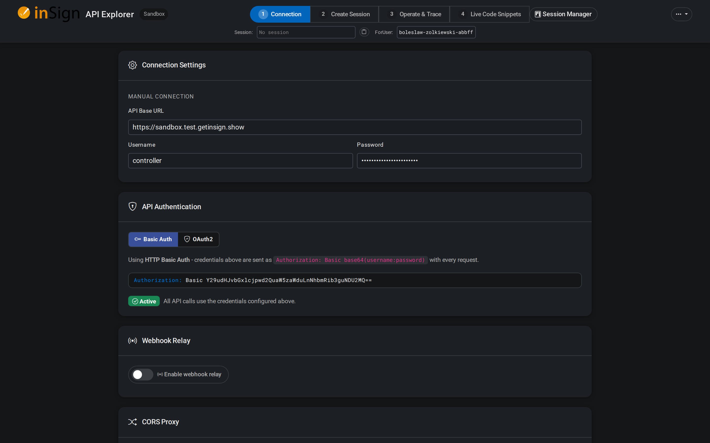

---

## Table of Contents

- [Getting Started](#getting-started)
- [Step 1 - Connection & Authentication](#step-1---connection--authentication)
  - [Connection Settings](#connection-settings)
  - [Saved Connection Profiles](#saved-connection-profiles)
  - [Basic Auth](#basic-auth)
  - [OAuth2 Authentication](#oauth2-authentication)
- [Step 2 - Create Session](#step-2---create-session)
  - [Session Feature Configurator](#session-feature-configurator)
  - [Branding & CSS Customizer](#branding--css-customizer)
  - [Logo Sets](#logo-sets)
  - [Document Selection & File Delivery](#document-selection--file-delivery)
  - [Request Body Editor](#request-body-editor)
    - [Autocomplete](#autocomplete)
    - [Hover Tooltips](#hover-tooltips)
- [Step 3 - Operate & Trace](#step-3---operate--trace)
  - [API Operations](#api-operations)
  - [Sidebar: Webhooks](#sidebar-webhooks)
  - [Sidebar: Status Polling](#sidebar-status-polling)
  - [Sidebar: API Trace](#sidebar-api-trace)
- [Step 4 - Live Code Snippets](#step-4---live-code-snippets)
  - [Supported Languages](#supported-languages)
  - [Template Variables](#template-variables)
- [Webhooks](#webhooks)
  - [Supported Providers](#supported-webhook-providers)
  - [Cloudflare Worker Relay](#cloudflare-worker-relay)
- [CORS & Proxy](#cors--proxy)
  - [The Problem](#the-problem)
  - [Option A - Local CORS Proxy](#option-a---local-cors-proxy)
  - [Option B - Server-side CORS Configuration](#option-b---server-side-cors-configuration)
  - [Cloudflare Worker as CORS Proxy](#cloudflare-worker-as-cors-proxy)
- [API Endpoints Reference](#api-endpoints-reference)
- [Security Considerations](#security-considerations)

---

## Getting Started

The API Explorer is a four-step guided workflow:

| Step | Name | Purpose |
|------|------|---------|
| **1** | Connection | Configure server URL, credentials, auth mode, webhooks |
| **2** | Create Session | Build a signing session with branding, features, and documents |
| **3** | Operate & Trace | Execute API operations and inspect request/response details |
| **4** | Live Code Snippets | Get generated code in 8 languages for any API call you make |

Navigate between steps using the step indicator in the top navigation bar. Steps light up as they become active.


> The app supports both **dark mode** (default) and **light mode**, toggled via the moon/sun icon in the navbar.

---

## Step 1 - Connection & Authentication

### Connection Settings

Configure the API server and credentials to connect to your inSign instance.

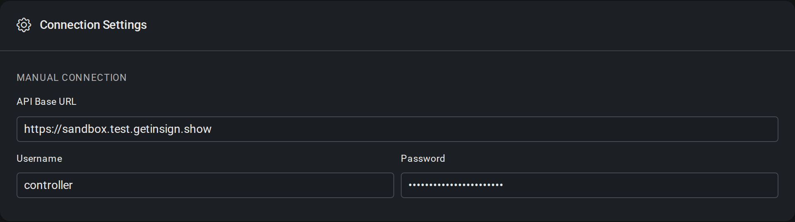

| Field | Default | Description |
|-------|---------|-------------|
| **API Base URL** | `https://sandbox.test.getinsign.show` | The root URL of your inSign server |
| **Username** | `controller` | API username |
| **Password** | `pwd.insign.sandbox.4561` | API password (masked) |

The sandbox at `sandbox.test.getinsign.show` has relaxed CORS settings and works directly from any origin without a proxy.

### Saved Connection Profiles

Click **"Save connection in browser"** to store your current URL, username, and password as a named profile in `localStorage`. Saved profiles appear in a dropdown above the URL field for quick switching.

- Profiles persist across browser sessions
- Delete any profile via the **x** button on its entry
- A security warning reminds you that `localStorage` is unencrypted

> **Tip:** Only save credentials on trusted devices for non-production environments.

### Basic Auth

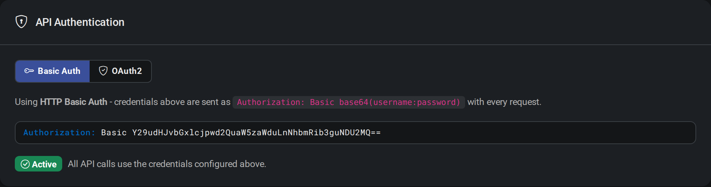

The default authentication mode. Credentials are sent as an HTTP header with every request:

```
Authorization: Basic base64(username:password)
```

The header preview updates in real-time as you type your credentials. A green "Active" badge confirms that Basic Auth is in use.

### OAuth2 Authentication

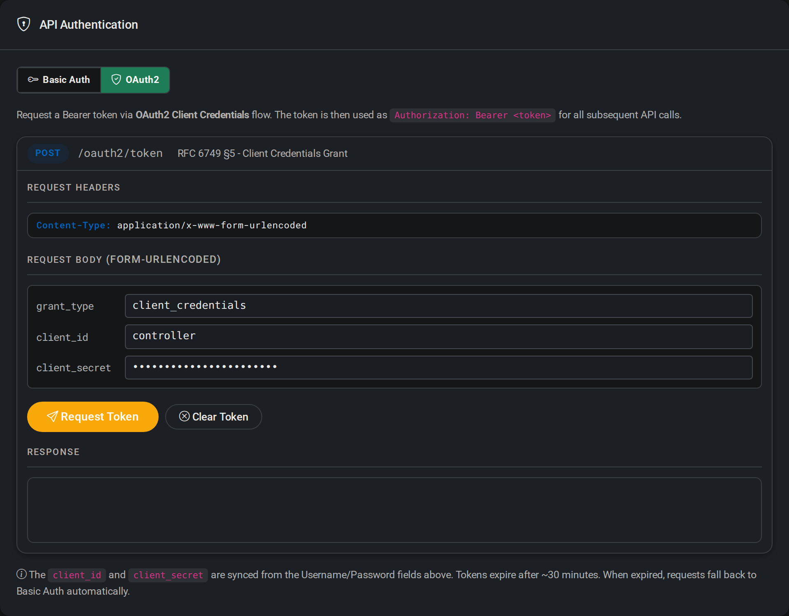

Switch to OAuth2 using the toggle at the top of the Authentication card. The OAuth2 panel implements the **Client Credentials Grant** flow (RFC 6749 Section 5):

**Request:**
```
POST /oauth2/token
Content-Type: application/x-www-form-urlencoded

grant_type=client_credentials&client_id=<username>&client_secret=<password>
```

**Workflow:**
1. `client_id` and `client_secret` auto-sync from the Username/Password fields
2. Click **"Request Token"** to obtain a Bearer token
3. The response shows the `access_token` and `expires_in` (typically ~30 minutes)
4. A live TTL countdown displays remaining token validity
5. All subsequent API calls automatically use `Authorization: Bearer <token>`
6. When the token expires, requests fall back to Basic Auth
7. Click **"Clear Token"** to manually revert to Basic Auth

---

## Step 2 - Create Session

This step builds and sends a `POST /configure/session` request to create a new signing session.

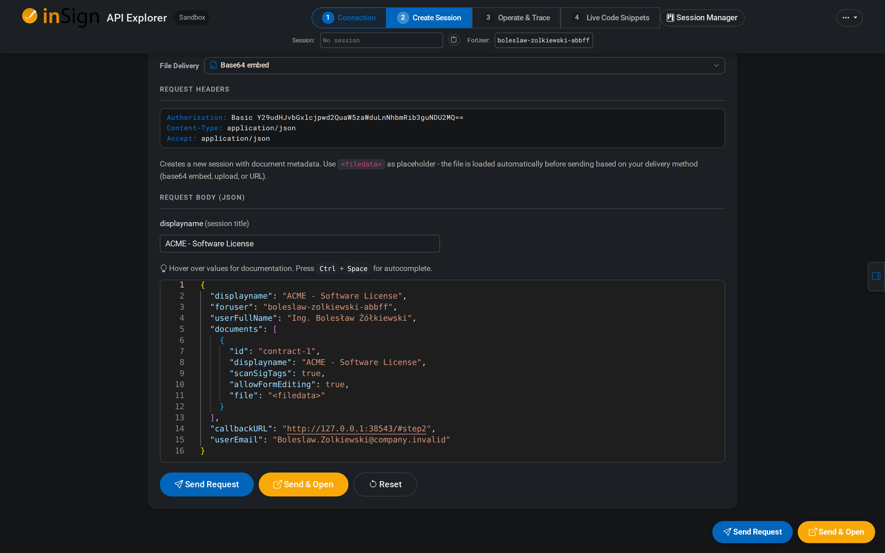

The page includes:
- A live **request header** preview showing your current auth method
- **Session Feature Configurator** - visual toggles for session behavior
- **Branding & CSS Customizer** - color schemes, logos, and CSS generation
- **Session Owner** fields - displayname, foruser, userFullName, userEmail
- **Document selector** with branded sample contracts
- **File delivery** mode selection
- **JSON request body editor** with Monaco Editor (syntax highlighting + autocomplete)
- Floating **"Send"** and **"Send & Open"** action buttons

### Session Feature Configurator


A collapsible panel with visual toggles for every configurable session property. Features are organized into groups:

- **Session Basics** - displayname, description, etc.
- **User Assignment** - foruser, multiple signing users
- **Documents** - multipage, includeAnnotations
- **Roles & Signature Fields** - role-based signing
- **Workflow Options** - parallel signing, manual completion
- **Branding Options** - CSS and logo injection
- **Delivery & Callbacks** - webhook URLs, content types

**Control Types:**
- **Three-state toggles** - Default / On / Off
  - **Default** = property omitted from JSON (uses server default)
  - **On/Off** = explicitly set in the request body
- **Text inputs** - for string/number values
- **Dropdowns** - for enum choices

**Key Features:**
- **Search** - filter features by name, key, property, or description
- **Expand / Collapse** - toggle all groups at once
- **Info icons** - click to pin a feature's description inline
- **Multi-user detection** - dashed borders highlight when users have differing values

### Branding & CSS Customizer

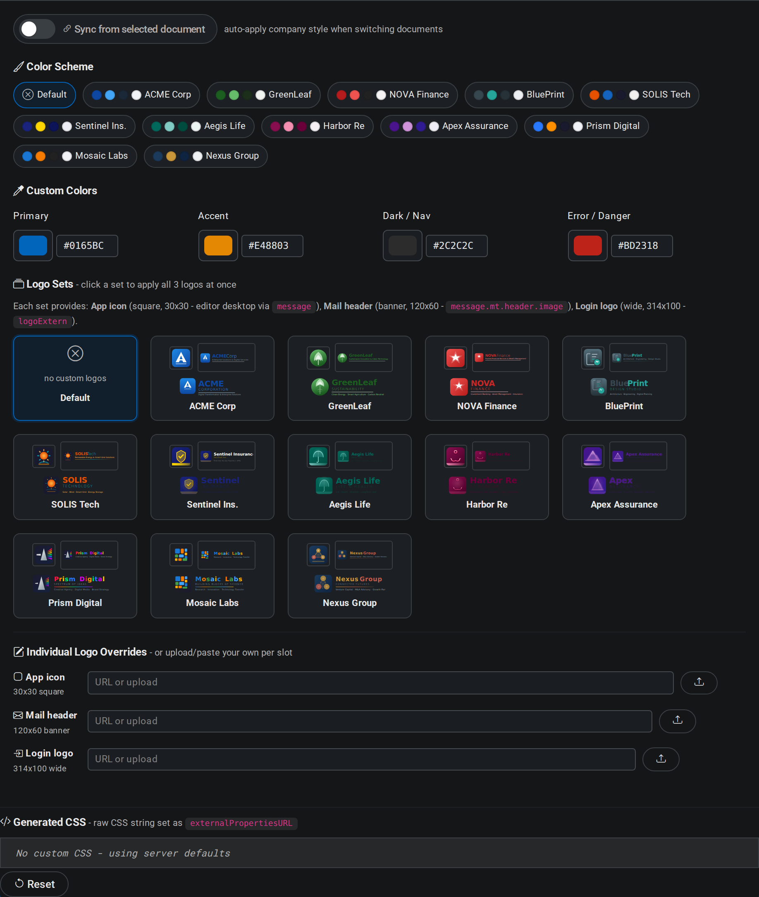

Customize the signing UI appearance by generating CSS variables that are injected via the `externalPropertiesURL` session property.

#### Color Schemes

Choose from **12 pre-built color schemes**, each designed for a different fictitious brand:

| Scheme | Primary | Accent | Style |
|--------|---------|--------|-------|
| ACME Corp | `#0D47A1` | `#42A5F5` | Corporate blue |
| GreenLeaf | `#2E7D32` | `#66BB6A` | Environmental green |
| NOVA Finance | `#1565C0` | `#FF6F00` | Finance blue-orange |
| BluePrint | `#0277BD` | `#00BCD4` | Tech cyan |
| SOLIS Tech | `#E65100` | `#FF9800` | Energy orange |
| Sentinel Ins. | `#1A237E` | `#3F51B5` | Insurance navy |
| Aegis Life | `#004D40` | `#26A69A` | Life teal |
| Harbor Re | `#263238` | `#546E7A` | Reinsurance slate |
| Apex Assurance | `#4A148C` | `#AB47BC` | Assurance purple |
| Prism Digital | `#AD1457` | `#EC407A` | Digital pink |
| Mosaic Labs | `#00695C` | `#4DB6AC` | Research teal |
| Nexus Group | `#37474F` | `#78909C` | Consulting grey |

#### Custom Color Pickers

Fine-tune four core colors with interactive pickers and hex input:

| Color | Purpose | Default |
|-------|---------|---------|
| **Primary** | Main brand color, buttons, links | `#0165BC` |
| **Accent** | Call-to-action buttons, highlights | `#E48803` |
| **Dark / Nav** | Navigation bar, dark backgrounds | `#2C2C2C` |
| **Error / Danger** | Error states, destructive actions | `#BD2318` |

Additional colors are **auto-derived**:
- **Success** - fixed `#0A8765`
- **Surface** - derived from Dark (lightened + desaturated)
- **Text** - derived from Dark (lightened + desaturated)

#### Generated CSS

The customizer outputs a complete CSS string using `color-mix(in srgb, ...)` for generating variant shades. The output is displayed in a rich editor with inline color swatches:

```css
:root {
  /* Primary / Blue Palette */
  --insignBlue: #0165BC;
  --800: color-mix(in srgb, var(--insignBlue), white 30%);
  --insignNavy: color-mix(in srgb, var(--insignBlue), black 20%);
  /* ... more variables ... */
}
```

This CSS string is set as the `externalPropertiesURL` property in the session JSON.

### Logo Sets

12 matching logo sets are available, each providing three logo variants:

| Slot | Size | Session Property | Purpose |
|------|------|------------------|---------|
| **App icon** | 30x30 px | `guiProperties['message.start.logo.url.editor.desktop']` | In-app editor icon |
| **Mail header** | 120x60 px | `guiProperties['message.mt.header.image']` | Email notification banner |
| **Login logo** | 314x100 px | `logoExtern` | External signing login page |

Click a logo set card to apply all three logos at once. Use the **Individual Logo Overrides** section to upload or paste URLs per slot.

### Document Selection & File Delivery

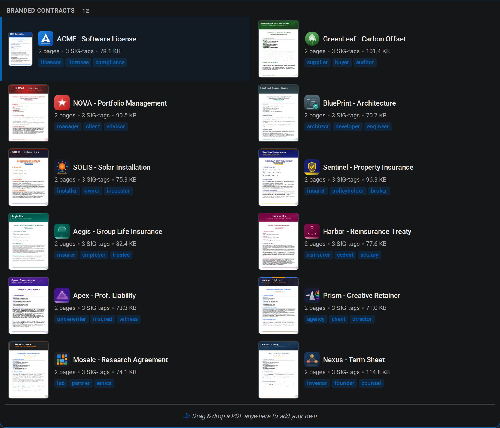

Select from **12 branded sample contracts** (pre-generated PDFs with matching company branding) or upload your own PDF. Documents are displayed as cards in a grid with lazy-loaded PDF thumbnail previews.

Each sample contract card shows:
- PDF thumbnail of the first page
- Company logo and contract title
- Page count, signature tag count, and file size
- Signing role badges (e.g., "Manager", "Client", "Witness")

You can also **drag and drop** your own PDF anywhere on the page to upload it.

**File Delivery Options:**

| Mode | Description |
|------|-------------|
| **Base64 embed** | File content is base64-encoded directly in the JSON request body |
| **Upload after create** | Session is created first, then the file is uploaded via a separate `POST /configure/uploaddocument` call |
| **URL reference** | The JSON body contains a `fileURL` pointing to the document - the inSign server fetches it |

### Request Body Editor

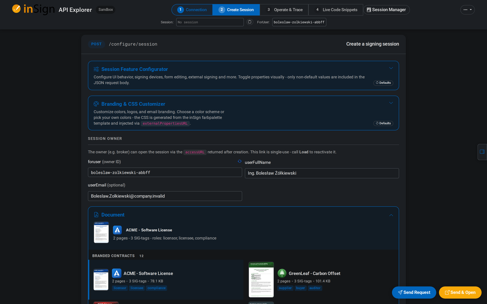

The JSON request body is editable in a **Monaco Editor** instance with:
- Syntax highlighting and auto-indentation
- `Ctrl+Space` **autocomplete** for all session properties, populated from the OpenAPI schema
- **Hover tooltips** showing property documentation, type info, enum values, and deprecation warnings
- Automatic updates when toggling features, selecting documents, or changing branding

#### Autocomplete

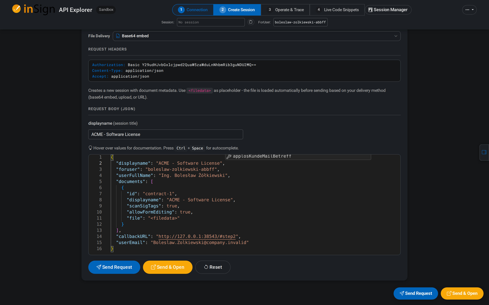

Press `Ctrl+Space` anywhere in the JSON editor to see available properties with their types and descriptions. The autocomplete list is generated from the server's OpenAPI specification and includes all session configuration properties.

#### Hover Tooltips

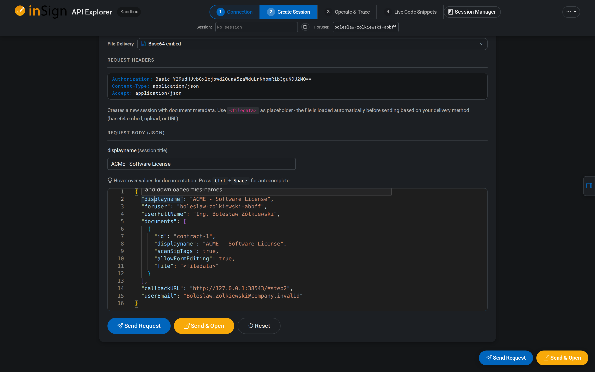

Hover over any JSON key to see its full documentation inline - including the property type, allowed values, and a description from the API schema. These tooltips work in the request body editor, the trace sidebar, and the status polling panel.

---

## Step 3 - Operate & Trace

After creating a session, use Step 3 to execute API operations and inspect their results. The main panel shows operation tabs on the left, while the right sidebar provides three collapsible sections: **Webhooks**, **Status Polling**, and **API Trace**.

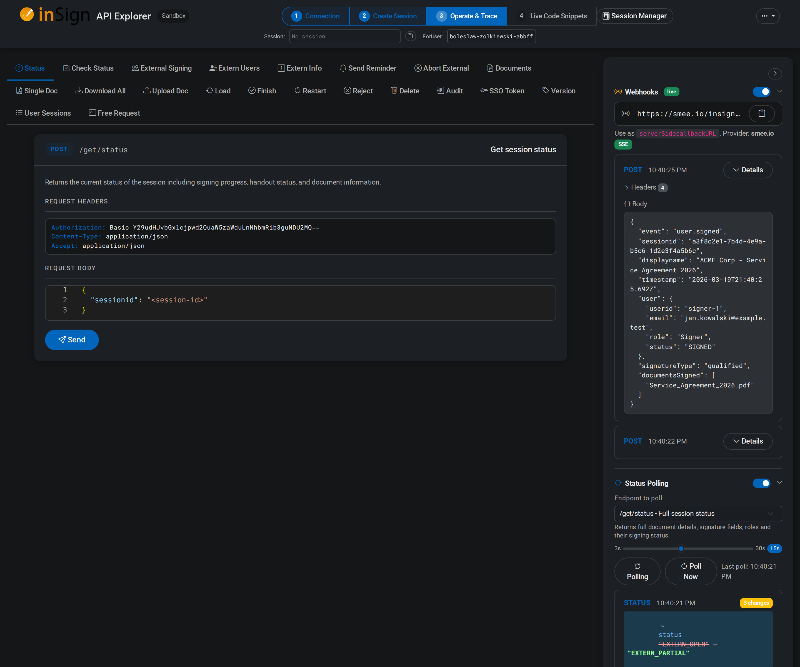

### API Operations

17 operation tabs, each with a dedicated request/response panel:

| Tab | Endpoint | Method | Description |
|-----|----------|--------|-------------|
| Status | `/get/status` | POST | Session progress, user and document status |
| External Signing | `/extern/beginmulti` | POST | Start external signing flow |
| Extern Users | `/extern/users` | POST | List external signing recipients |
| Extern Info | `/get/externInfos` | POST | External signing session metadata |
| Send Reminder | `/load/sendManualReminder` | POST | Send reminder to pending signers |
| Abort External | `/extern/abort` | POST | Cancel external signing |
| Documents (Full) | `/get/documents/full` | POST | All documents with annotations |
| Single Doc | `/get/document` | POST | Single PDF download |
| Download All | `/get/documents/download` | POST | All signed PDFs as ZIP |
| Upload Doc | `/configure/uploaddocument` | POST | Upload a document (multipart) |
| Load Session | `/persistence/loadsession` | POST | Load/reactivate a saved session |
| Finish | `/configure/fertig` | POST | Mark session complete |
| Restart | `/configure/restartsession` | POST | Reset session to signing state |
| Reject | `/configure/ablehnen` | POST | Reject and delete documents |
| Delete Session | `/persistence/purge` | POST | Completely remove session |
| Audit | `/get/audit` | POST | Audit trail of session activities |
| SSO Token | `/configure/createSSOForApiuser` | POST | Create SSO session for API user |
| Version | `/version` | GET | Server version info |
| Free Request | *(custom)* | ANY | Arbitrary API calls to any endpoint |

Each operation tab shows:
- The HTTP method badge and endpoint path
- A brief endpoint description
- Request headers (Authorization, Content-Type, Accept)
- Request body in Monaco Editor
- A **Send** button
- Response panel with status badge (green for 2xx, red for errors)

### Sidebar: Webhooks

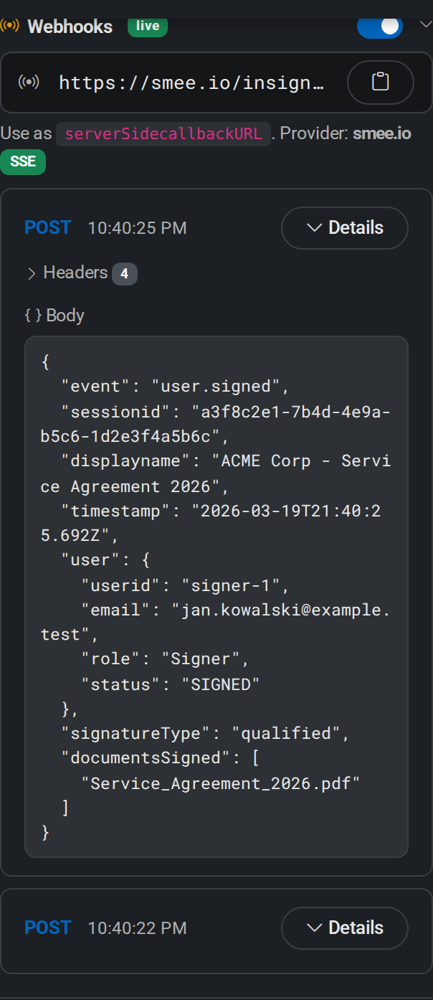

The Webhooks section displays real-time callbacks received from the inSign server. Each incoming webhook is shown as a card with:
- HTTP method badge and timestamp
- Expandable **Details** panel with:
  - **Headers** - collapsible list of HTTP headers (e.g., `X-inSign-Event`, `X-inSign-SessionId`)
  - **Body** - full JSON payload with syntax highlighting
- The webhook endpoint URL is shown at the top with a copy button
- Provider badge (e.g., "SSE" for smee.io, "poll" for webhook.site) indicates the transport mode

Incoming requests are de-duplicated by ID to prevent double processing during reconnections.

### Sidebar: Status Polling

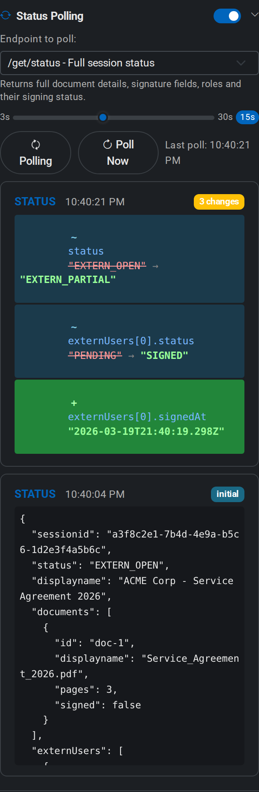

The Status Polling section automatically polls a selected endpoint at a configurable interval and **highlights what changed** between consecutive responses using a color-coded diff view.

**Configuration:**
- **Endpoint selector** - choose which endpoint to poll (`/get/status`, `/get/checkstatus`, `/get/externInfos`, or `/get/audit`)
- **Interval slider** - set the polling interval from 3 to 30 seconds
- **Polling / Poll Now** buttons - start continuous polling or trigger a single poll

**Diff Display:**

The first poll shows the full response body as an "initial" card. Subsequent polls compare the new response against the previous one and display only the differences:

| Indicator | Color | Meaning |
|-----------|-------|---------|
| `~` (tilde) | Blue | Property value **changed** - shows old value (strikethrough) and new value |
| `+` (plus) | Green | Property was **added** - shows the new value |
| `-` (minus) | Red | Property was **removed** - shows the old value (strikethrough) |

Each diff row shows the JSON path (e.g., `externUsers[0].status`) and the value change. This makes it easy to monitor signing progress in real-time - for example, seeing a signer's status change from `"PENDING"` to `"SIGNED"`.

### Sidebar: API Trace

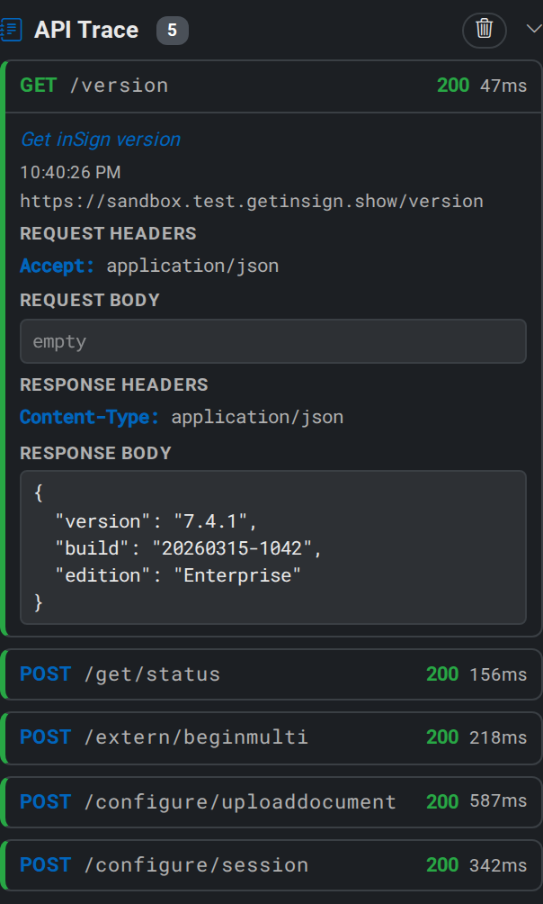

The API Trace section records every API call made during the session, providing a chronological log of all requests and responses:

- **Method badge** - color-coded: POST green, GET blue, DELETE red
- **Endpoint path** and HTTP **status code**
- **Response time** in milliseconds
- **Expandable details** for each entry:
  - Request headers (with truncated Authorization values)
  - Request body (with schema-aware JSON tooltips when OpenAPI spec is loaded)
  - Response headers
  - Response body (with schema-aware JSON tooltips)
- **Entry count badge** in the section header
- **Clear** button to reset the trace log

JSON keys in the trace bodies display hover tooltips with property documentation from the OpenAPI schema, making it easy to understand the meaning of each field without leaving the trace view.

---

## Step 4 - Live Code Snippets

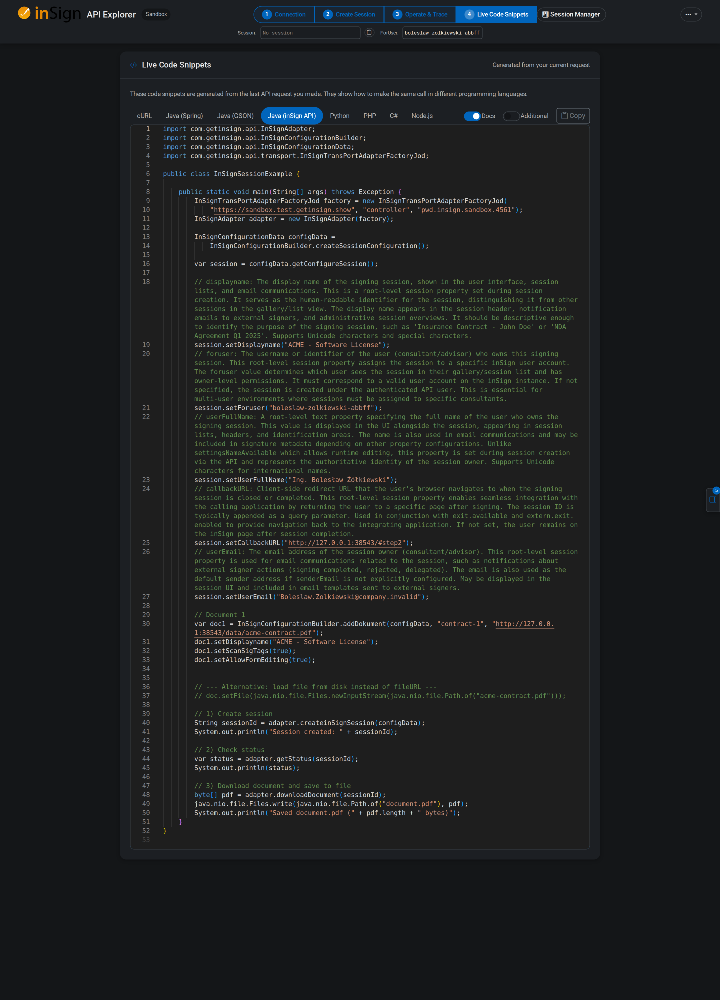

Every API call you make is automatically converted into ready-to-use code snippets in 8 programming languages. The snippets reflect your exact request - method, path, headers, authentication, and body.

### Supported Languages

| Language | Library / Approach | Template File |
|----------|-------------------|---------------|
| **cURL** | Shell script with `-u` flag for Basic Auth | `codegen-templates/curl.sh` |
| **Java (Spring)** | `RestTemplate` with `HttpHeaders` | `codegen-templates/java-spring.java` |
| **Java (GSON)** | Raw `JsonObject` building with `HttpURLConnection` | `codegen-templates/java-gson.java` |
| **Java (inSign API)** | Native inSign Java library (`InSignAdapter`) | `codegen-templates/java-insign.java` |
| **Python** | `requests` library | `codegen-templates/python.py` |
| **PHP** | `curl_init()` / `curl_exec()` | `codegen-templates/php.php` |
| **C#** | `HttpClient` with `StringContent` | `codegen-templates/csharp.cs` |
| **Node.js** | Native `fetch` (Node 18+) | `codegen-templates/nodejs.js` |

### Template Variables

Code templates use placeholders that are replaced with your current request data:

| Variable | Description |
|----------|-------------|
| `{{METHOD}}` | HTTP method (GET, POST, etc.) |
| `{{PATH}}` | API path (e.g., `/configure/session`) |
| `{{URL}}` | Full URL including base |
| `{{BASE_URL}}` | Server base URL |
| `{{USERNAME}}` | API username |
| `{{PASSWORD}}` | API password |
| `{{BODY_JSON}}` | JSON body as a string literal |
| `{{BODY_BUILD}}` | Body constructed using language-native builders |
| `{{CONTENT_TYPE}}` | Content-Type header value |

**Toggles:**
- **Docs** - include inline documentation comments in generated code
- **Additional** - include extra helper code and error handling
- **Copy** - copy the snippet to clipboard

---

## Webhooks

The API Explorer includes a built-in **webhook viewer** that receives and displays real-time callbacks from inSign. When a signing session changes status (e.g., document signed, session completed), inSign sends an HTTP POST to the configured `serverSidecallbackURL`.

Since this app runs in the browser and cannot receive HTTP requests directly, it uses **relay services** to bridge the gap.


### Supported Webhook Providers

| Provider | Transport | Latency | Persistence |
|----------|-----------|---------|-------------|
| **smee.io** | Server-Sent Events (SSE) | Real-time | Session only |
| **webhook.site** | REST polling (4s interval) | ~4 seconds | 24 hours |
| **postb.in** | FIFO queue polling | ~4 seconds | 30 minutes |
| **ntfy.sh** | SSE pub/sub | Real-time | Limited |
| **Cloudflare Worker** | SSE + polling | Real-time | Cache-based |
| **Custom URL** | Manual | N/A | N/A |

**Provider details:**

- **smee.io** (default) - GitHub-hosted SSE service. Creates a unique `https://smee.io/insign-<randomId>` URL and streams events in real-time to your browser.

- **webhook.site** - Creates a unique inbox at `https://webhook.site/<uuid>`. The app polls every 4 seconds for new requests. Data is visible on the webhook.site web UI.

- **postb.in** - Creates a temporary bin at `https://www.postb.in/<binId>`. Uses FIFO shift operations to dequeue received requests. Bins expire after 30 minutes.

- **ntfy.sh** - Pub/sub messaging via SSE. Creates a topic at `https://ntfy.sh/insign-wh-<randomId>`. Note: JSON bodies may be interpreted as ntfy commands.

- **Cloudflare Worker** - Self-hosted relay (see below). Combines CORS proxy + webhook relay in a single worker.

- **Custom URL** - Enter your own webhook endpoint. No auto-polling; the URL is simply injected into the session JSON.

**Webhook Display:**
- Incoming webhooks appear in the sidebar with:
  - HTTP method badge
  - Timestamp
  - Collapsible headers section
  - JSON body with syntax highlighting
- Requests are de-duplicated by ID to avoid double processing
- Real-time notification callbacks trigger UI updates

### Cloudflare Worker Relay

A dual-purpose Cloudflare Worker (`data/cf-webhook-worker.js`) that serves as both a CORS proxy and a webhook relay. Deploy to Cloudflare Workers free tier - no credit card required.

**Endpoints:**

| Method | Path | Purpose |
|--------|------|---------|
| `POST` | `/channel/new` | Create a new webhook channel (returns `id`, `url`, `pollUrl`) |
| `POST` | `/channel/{id}` | Receive webhook payload (called by inSign) |
| `GET` | `/channel/{id}/requests` | Poll for stored requests |
| `GET` | `/channel/{id}/stream` | SSE real-time stream |
| `DELETE` | `/channel/{id}` | Clean up channel |
| `GET` | `/?https://target.com/path` | CORS proxy mode |

**Storage:** Uses Cloudflare Cache API with individual entry caching and a sliding window of up to 200 entries per channel.

---

## CORS & Proxy

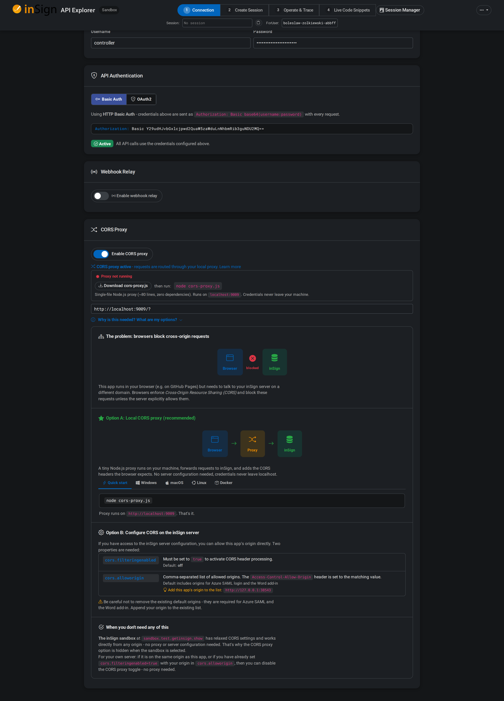

### The Problem

This app runs in your browser (e.g., on GitHub Pages) but needs to talk to your inSign server on a different domain. Browsers enforce **Cross-Origin Resource Sharing (CORS)** and block these requests unless the server explicitly allows them.

```
Browser  --[blocked]-->  inSign Server
```

### Option A - Local CORS Proxy

**Recommended.** A single-file Node.js proxy (~80 lines, zero dependencies) runs on your machine and forwards requests to inSign while adding the CORS headers the browser expects.

```
Browser  -->  localhost:9009  -->  inSign Server
```

**Setup:**

```bash
# Download cors-proxy.js from the app, then:
node cors-proxy.js
# Proxy runs on http://localhost:9009
```

Platform-specific instructions are available in the app for Windows (PowerShell), macOS (brew), Linux (apt), and Docker:

```bash
# Docker (no Node.js install needed):
docker run --rm -p 9009:9009 -v ./cors-proxy.js:/app.js node:alpine node /app.js
```

**How it works:**
1. The browser sends requests to `http://localhost:9009/?https://target.com/api/path`
2. The proxy extracts the target URL from the query parameter
3. Strips hop-by-hop headers (host, origin, referer, connection)
4. Forwards the request to the target with all other headers preserved
5. Adds CORS response headers (`Access-Control-Allow-Origin: *`, etc.)
6. Returns the response to the browser

**Auto-detection:** When a direct API call fails with a CORS error, the app automatically enables the proxy, retries the request, and notifies you.

**Status indicator:** A colored dot next to the proxy URL shows connection status:
- Green = proxy is running and reachable
- Red = proxy is not responding

### Option B - Server-side CORS Configuration

If you have access to the inSign server configuration, set these properties:

| Property | Value | Description |
|----------|-------|-------------|
| `cors.filteringenabled` | `true` | Activates CORS header processing |
| `cors.alloworigin` | Comma-separated origins | Add this app's origin to the existing list |

> **Warning:** Do not remove the existing default origins - they are required for Azure SAML login and the Word add-in. Append your origin to the list.

### Cloudflare Worker as CORS Proxy

The same Cloudflare Worker used for webhook relay also functions as a CORS proxy. Requests using the `/?url` pattern are forwarded to the target with CORS headers added:

```
http://your-worker.workers.dev/?https://your-insign.com/api/path
```

---

## API Endpoints Reference

### Session Lifecycle

| Method | Endpoint | Description |
|--------|----------|-------------|
| `POST` | `/configure/session` | Create a new signing session |
| `POST` | `/configure/uploaddocument` | Upload a document to an existing session |
| `POST` | `/configure/fertig` | Mark session as complete |
| `POST` | `/configure/restartsession` | Restart session (reset to signing state) |
| `POST` | `/configure/ablehnen` | Reject session and delete documents |
| `POST` | `/persistence/purge` | Permanently delete a session |
| `POST` | `/persistence/loadsession` | Load/reactivate a previously saved session |

### External Signing

| Method | Endpoint | Description |
|--------|----------|-------------|
| `POST` | `/extern/beginmulti` | Start external signing for multiple users |
| `POST` | `/extern/users` | List external signing recipients |
| `POST` | `/extern/abort` | Abort external signing process |
| `POST` | `/get/externInfos` | Get external signing session metadata |
| `POST` | `/load/sendManualReminder` | Send reminder to pending signers |

### Data Retrieval

| Method | Endpoint | Description |
|--------|----------|-------------|
| `POST` | `/get/status` | Session status including signing progress |
| `POST` | `/get/documents/full` | All documents with annotations and field mapping |
| `POST` | `/get/document` | Single document PDF (query params: `sessionid`, `docid`) |
| `POST` | `/get/documents/download` | Download all signed PDFs as ZIP |
| `POST` | `/get/audit` | Audit trail of all session activities |

### Authentication & System

| Method | Endpoint | Description |
|--------|----------|-------------|
| `POST` | `/oauth2/token` | Request OAuth2 Bearer token |
| `POST` | `/configure/createSSOForApiuser` | Create SSO session for API user |
| `GET` | `/version` | Server version information |

### Session JSON Structure

```json
{
  "foruser": "session-owner-userid",
  "displayname": "Session display name",
  "description": "Optional description",
  "userFullName": "Owner Full Name",
  "userEmail": "owner@example.test",
  "documents": [
    {
      "id": "doc-id-1",
      "displayname": "Document name",
      "filedata": "<base64-encoded-pdf>",
      "fileURL": "https://example.test/document.pdf"
    }
  ],
  "serverSidecallbackURL": "https://webhook.endpoint/path",
  "serversideCallbackMethod": "POST",
  "serversideCallbackContenttype": "json",
  "externalPropertiesURL": "<generated-css-string>",
  "logoExtern": "https://logo.url/login.svg",
  "guiProperties": {
    "message.start.logo.url.editor.desktop": "https://logo.url/icon.svg",
    "message.mt.header.image": "https://logo.url/mail-header.svg"
  }
}
```

---

## Security Considerations

### Credential Storage

- Saved connection profiles use browser `localStorage` (unencrypted)
- Any browser extension or XSS vulnerability could read stored credentials
- Data persists after closing the browser
- Delete saved entries anytime via the **x** button
- **Recommendation:** Only save on trusted devices for non-production credentials

### CORS Proxy

- The local proxy routes all requests through `localhost` - credentials never leave your machine
- The Cloudflare Worker alternative is self-hosted and under your control
- A security banner is displayed whenever the CORS proxy is active

### Webhook Relay

- Public relay services (smee.io, webhook.site, postb.in) route webhook data through third-party servers
- Webhook payloads may contain **session IDs**, **signer names**, **email addresses**, and **document metadata**
- The relay service operator can see, log, and store all data in plain text
- **Recommendation:** Use the Cloudflare Worker option or a self-hosted endpoint for production data

### Application Security

- This app runs entirely in the browser - no server-side code, no data storage beyond `localStorage`
- API credentials are sent only to the configured inSign server (or through the CORS proxy to that server)
- The app loads from GitHub Pages over HTTPS
- No analytics, tracking, or third-party data collection

---

## Dark Mode & Light Mode

The app supports both themes with automatic system preference detection. Toggle manually via the moon/sun icon in the navbar. Your preference is saved in `localStorage`.

---

## Project Structure

```
docs/
  index.html                    # Developer hub / landing page
  guide.html                    # Getting Started guide (interactive walkthrough)
  js/
    app.js                      # Application logic and UI orchestration
    api-client.js               # HTTP client with auth, CORS proxy, tracing
    code-generator.js           # Template-based code generation engine
    webhook-viewer.js           # Multi-provider webhook receiver
    pdf-viewer.js               # Canvas-based PDF preview
    openapi-schema-loader.js    # OpenAPI spec loader for autocomplete
  css/
    style.css                   # Structural styles
    style-theme.css             # Theme variables and dark/light mode
  codegen-templates/            # 8 language templates (curl, java, python, etc.)
  data/
    names.json                  # 100 EU names with unicode chars for user generation
    branded-contracts.json      # 12 branded sample contracts
    feature-descriptions.json   # Feature metadata and descriptions
    cf-webhook-worker.js        # Cloudflare Worker source
    *.pdf                       # Pre-generated sample contract PDFs
  img/
    sample-logos/               # 36 SVG logos (12 brands x 3 variants)
    doc-headers/                # 12 SVG document headers
  fonts/                        # Web fonts
cors-proxy.js                   # Local Node.js CORS proxy (~80 lines)
```

---

**[inSign GmbH](https://www.getinsign.com/)** - Simple signature processes | [Impressum](https://www.getinsign.de/impressum/) | [Datenschutz](https://www.getinsign.de/datenschutz/)
