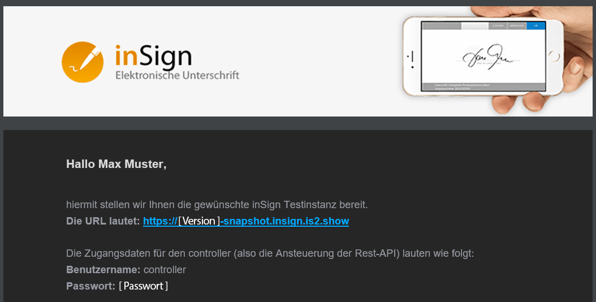
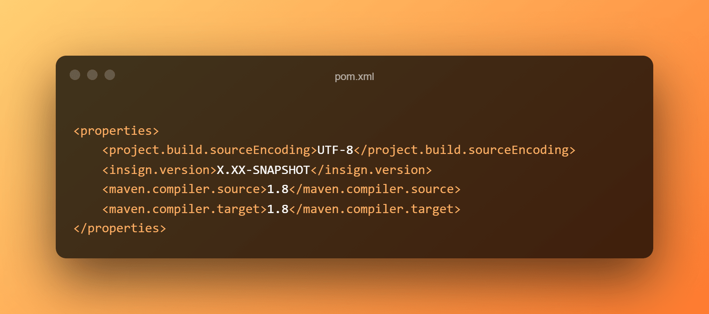
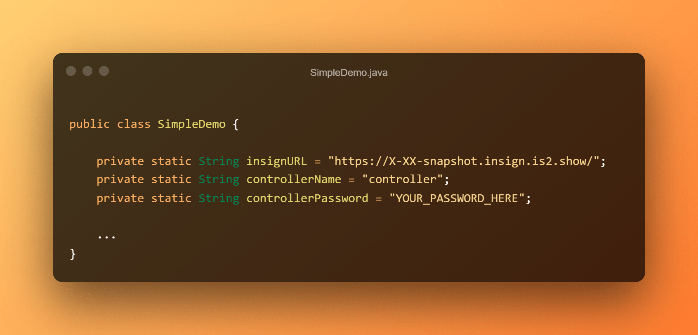

[](https://www.getinsign.com/)
------
**Languages: English (this file), [German](readme_DE.md).**

# Getting started

This java project will aid you in getting started with the inSign java-api implementation.
It consists of the following parts:

* A settings.xml file with the url and some basic credentials to access the java-api artifacts from the private iS2 maven repository.
* A minimal pom.xml importing the needed the insign-java-api.jar.
* A SimpleDemo.java class that shows some basic usage of the API.

## Setup

The following steps are required for the setup:

First copy the `settings.xml` into you local `C:\Users\YOUR.USERNAME\.m2\` folder if it does not exist yet. If you already have a config file make sure to add the content of `settings.xml` to your already existing file.<br />
This lets you access the inSign dependencies from the private iS2 maven repository.

Second, open the email you received for the desired test instance.<br/>
There you will find an `URL` and the `password` for the controller.<br/>
To get the `current version` log into your instance with the provided `roadadmin` credentials. There you will find build information on the bottom left.



Insert the version number to the `insign.version` property in the pom.xml file:



```xml
    <properties>
        <project.build.sourceEncoding>UTF-8</project.build.sourceEncoding>
        <insign.version>X.XX-SNAPSHOT</insign.version>
        <maven.compiler.source>1.8</maven.compiler.source>
        <maven.compiler.target>1.8</maven.compiler.target>
    </properties>
```

Next open the `SimpleDemo` java class and paste the URL from the email above into the `insignURL` variable.<br/>
Do the same for the `controllerPassword`.



```java
    public class SimpleDemo {
    
        private static String insignURL = "http://X-XX-snapshot.insign.is2.show/";
        private static String controllerName = "controller";
        private static String controllerPassword = "YOUR_PASSWORD_HERE";
        
        ...
    }
```

Now you can run a maven build to download and use the required artifacts from the private iS2 repository.<br/>
If you are using Eclipse, this is done by right-clicking on the project ➜ `Run As` ➜ `Maven install`.<br/>
After that right click again and run ➜ `Maven` ➜ `Update project`.

After the `Maven install` command execution there will be a second package in your java source folder.
This package includes several java classes demonstrating advanced usage. In order to be able to run these
examples you have to input the same data as above in `ApiData.java`.


```java
    public class ApiData {
        public static final String insignURL = "YOUR_INSTANCE_URL_HERE";
        public static final String controllerName = "controller";
        public static final String controllerPassword = "YOUR_PASSWORD_HERE";
        public static final String userID = "USER_ID_OF_SESSION_OWNER";
        public static final String userEMail = "YOUR_EMAIL_HERE";
    }
```

## Usage

Now you should be able to run the SimpleDemo as a java application. If everything was set up correctly your browser will be opened and show the test document.

## Developed By

[iS2 Intelligent Solution Services AG](https://www.is2.de/)

## License

    Copyright 2021 iS2 Intelligent Solution Services AG

    Licensed under the Apache License, Version 2.0 (the "License");
    you may not use this file except in compliance with the License.
    You may obtain a copy of the License at

       http://www.apache.org/licenses/LICENSE-2.0

    Unless required by applicable law or agreed to in writing, software
    distributed under the License is distributed on an "AS IS" BASIS,
    WITHOUT WARRANTIES OR CONDITIONS OF ANY KIND, either express or implied.
    See the License for the specific language governing permissions and
    limitations under the License.
