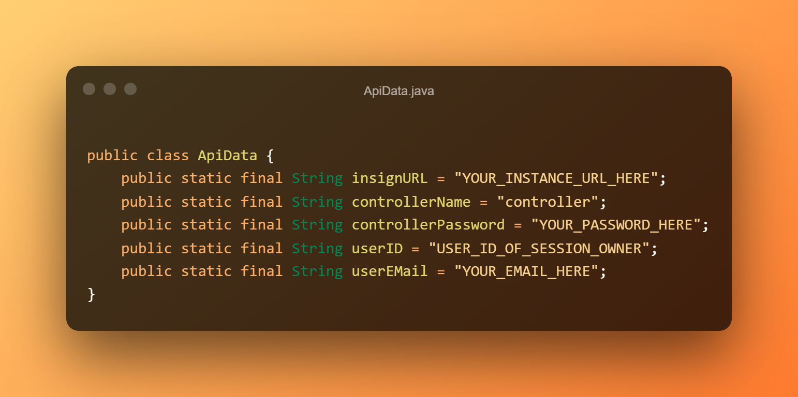

[](https://www.getinsign.com/)
------
**Sprachen: Deutsch (diese Datei), [Englisch](readme.md).**

# Allgemein

Dieses Java Projekt hilft Ihnen dabei, sich mit der Ansteuerung der inSign Java-API vertraut zu machen.
Es besteht aus den folgenden Teilen:

* Ein settings.xml mit der URL und einigen grundlegenden Anmeldedaten für den Zugriff auf die Artefakte aus dem privaten iS2 Maven Repository.
* Ein minimales pom.xml, welches das benötigte insign-java-api.jar importiert.
* Eine SimpleDemo.java Klasse, die einige grundlegende Verwendungen der API zeigt.

## Einrichtung

Die folgenden Schritte sind für die Einrichtung erforderlich:

Kopieren Sie zunächst das `settings.xml` in den lokalen `C:\Users\YOUR.USERNAME\.m2\` Ordner, falls die Datei dort noch nicht existiert. Wenn es bereits eine Konfigurationsdatei gibt, müssen Sie den Inhalt von `settings.xml` in die bereits bestehende Datei hinzufügen.<br />
Dies ermöglicht Ihnen den Zugriff auf die inSign-Abhängigkeiten aus dem privaten iS2-Maven-Repository.

Die Demo ruft die API auf dem inSign-Sandbox-Demosystem auf, das sich unter https://sandbox.insign.is2.show/ befindet.

Nun kann der Maven-Build ausgeführt werden, um die erforderlichen Artefakte aus dem privaten iS2-Repository herunterzuladen und einzubinden.<br/>
Wenn Eclipse verwendet wird, geschieht dies durch einen Rechtsklick auf das Projekt ➜ `Run As` ➜ `Maven install`.<br/>
Klicken Sie danach erneut rechts und führen Sie ➜ `Maven` ➜ `Update project` aus.

Nach der Ausführung des `Maven install`-Befehls wird automatisch ein zweites Package in Ihrem Java-Sourceordner erstellt.
Dieses Package enthält mehrere Java-Klassen, die die erweiterte Nutzung zeigen. Um diese Beispiele ausführen zu können,
müssen Sie die gleichen Daten wie oben in `ApiData.java` eingeben.



```java
    public class ApiData {
        public static final String insignURL = "YOUR_INSTANCE_URL_HERE";
        public static final String controllerName = "controller";
        public static final String controllerPassword = "YOUR_PASSWORD_HERE";
        public static final String userID = "USER_ID_OF_SESSION_OWNER";
        public static final String userEMail = "YOUR_EMAIL_HERE";
    }
```

## Run it

## Verwendung

Jetzt sollten Sie in der Lage sein, SimpleDemo als Java-Anwendung auszuführen. Wenn alles korrekt eingerichtet wurde, wird der Browser geöffnet und das Testdokument angezeigt.

## Entwickelt von

[iS2 Intelligent Solution Services AG](https://www.is2.de/)

## Lizenz

    Copyright 2021 iS2 Intelligent Solution Services AG

    Licensed under the Apache License, Version 2.0 (the "License");
    you may not use this file except in compliance with the License.
    You may obtain a copy of the License at

       http://www.apache.org/licenses/LICENSE-2.0

    Unless required by applicable law or agreed to in writing, software
    distributed under the License is distributed on an "AS IS" BASIS,
    WITHOUT WARRANTIES OR CONDITIONS OF ANY KIND, either express or implied.
    See the License for the specific language governing permissions and
    limitations under the License.
