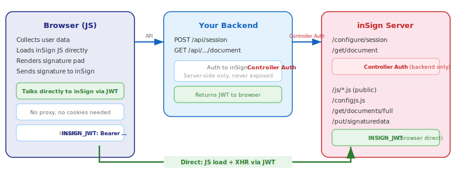

# Sig-Funnel — inSign Embedded Signature Pad Demo

A complete, working demo application that shows how to integrate the **inSign handwritten digital signature pad** into a web application. Built as a learning tool for third-party developers who want to add legally binding digital signatures to their own apps.

The demo implements a **SEPA Direct Debit Mandate** signing flow: the user fills out a form, signs on a canvas, and downloads the signed PDF — all in the browser.

---

## What This Demo Teaches

This is not just a code sample — it's an **interactive tutorial**. Each step of the signing flow includes collapsible developer documentation. The same markdown docs are shown in the app and linked here:

- **[Step 1 — Architecture Overview](docs/docs/step-1-architecture.md)** — Components, auth model, CORS, why no proxy is needed
- **[Step 2 — Session Creation & JWT](docs/docs/step-2-session-creation.md)** — API calls with JSON examples, `##SIG{...}` tags, `preFilledFields`
- **[Step 3 — Embedded Signature Pad](docs/docs/step-3-signature-pad.md)** — Loading inSign JS, `initEmbeddedData`, canvas setup, all JS functions
- **[Step 4 — Download & Cleanup](docs/docs/step-4-download.md)** — Retrieving signed PDFs, `unpair()`, status polling
- **[Integration Manual](docs/docs/integration-manual.md)** — Complete guide: auth model, mobile WebView, minimal example, pitfalls, security, production checklist

---

## Architecture

<p align="center">
  
</p>

### Complete API Call Sequence

<p align="center">
  
</p>

### Key Design Decisions

- **No proxy.** The browser talks directly to the inSign server. The embedded API is fully cookieless — authentication uses the `INSIGN_JWT` custom header. See [Architecture docs](docs/docs/step-1-architecture.md).

- **No cookies, no SameSite issues.** The inSign JS authenticates via `INSIGN_JWT: Bearer <token>` — a custom HTTP header, not cookies.

- **Controller credentials stay server-side.** The backend holds elevated controller auth (OAuth2 or Basic Auth) and never exposes it. The browser gets only a session-scoped JWT. See [Security section](docs/docs/integration-manual.md#8-security-considerations).

- **Single API call for session creation.** PDF as base64 + `preFilledFields` in one `/configure/session` call. See [Step 2 docs](docs/docs/step-2-session-creation.md).

- **Reusable PDF template.** Generated once with AcroForm fields and `##SIG{...}` tag. User data injected per session via `preFilledFields`.

---

## Quick Start

Choose your preferred way to run the demo:

### Option 0: run.sh (easiest)

```bash
./run.sh              # npm start (installs deps if needed)
./run.sh docker       # build & run via Docker
```

### Option 1: Local (Node.js)

```bash
git clone <repo-url>
cd sig-funnel
npm install
npm start         # or: npm run dev (auto-reload)
```

Open [http://localhost:3000](http://localhost:3000).

### Option 2: Glitch (instant, in-browser, free)

[](https://glitch.com/edit/#!/import/github/getinsign/insign-getting-started)

Click "Remix" to get your own copy running instantly. No install needed. Edit code in the browser, see results immediately.

### Option 3: StackBlitz (runs Node.js in the browser)

[](https://stackblitz.com/github/getinsign/insign-getting-started)

Runs the full Node.js server inside your browser via WebContainers. Nothing to install, no server needed.

### Option 4: Vercel (serverless, free tier)

[](https://vercel.com/new/clone?repository-url=https://github.com/getinsign/insign-getting-started&env=INSIGN_URL,INSIGN_USER,INSIGN_PASS)

The project includes Vercel serverless functions (`api/*.js`) that wrap the same shared route handlers used by the Express server. Static files are served from `docs/`. Set environment variables in the Vercel dashboard:

| Variable | Value |
|---|---|
| `INSIGN_URL` | `https://sandbox.test.getinsign.show` |
| `INSIGN_USER` | `controller` |
| `INSIGN_PASS` | `pwd.insign.sandbox.4561` |

### Architecture: Shared Code, Multiple Platforms

The core business logic lives in **one place** — `src/routes.js`:

```
src/routes.js          ← shared route handlers (createSession, getDocument, etc.)
src/insign-client.js   ← shared inSign API client
src/pdf-generator.js   ← shared PDF template generator

src/server.js          ← Express wrapper (local, Glitch, StackBlitz, Docker)
api/session.js         ← Vercel wrapper (imports from src/routes.js)
api/session/[key]/*.js ← Vercel wrappers for status + document endpoints
```

No code duplication — the Vercel functions are thin wrappers that call the same handlers.

---

## Running on Different Platforms

### Linux / macOS

```bash
git clone <repo-url>
cd sig-funnel
npm install
npm start
# Open http://localhost:3000

# Run tests (installs Chromium on first run)
npx playwright install chromium
npm test
```

### Windows (PowerShell / CMD)

```powershell
git clone <repo-url>
cd sig-funnel
npm install
npm start
# Open http://localhost:3000

# Run tests
npx playwright install chromium
npm test
```

### Windows (WSL2)

WSL2 works but Node.js file I/O on `/mnt/c/` (the Windows filesystem) is very slow due to the 9P filesystem bridge. For best performance, clone into the native Linux filesystem:

```bash
# Clone to Linux filesystem (fast)
cd ~
git clone <repo-url>
cd sig-funnel
npm install
npm start

# DO NOT use /mnt/c/... — startup can take 20s+ instead of 2s
```

For Playwright tests on WSL2, you need a display server or use headless mode (default):

```bash
npx playwright install chromium --with-deps
npm test
```

### Docker

A [`Dockerfile`](Dockerfile) is included. Build and run:

```bash
docker build -t sig-funnel .
docker run -p 3000:3000 sig-funnel

# With custom inSign server
docker run -p 3000:3000 \
  -e INSIGN_URL=https://your-insign-server.com \
  -e INSIGN_USER=your-controller \
  -e INSIGN_PASS=your-password \
  sig-funnel
```

Run tests inside Docker:

```bash
docker run --rm sig-funnel sh -c "npx playwright install chromium --with-deps && npm test"
```

### Docker Compose

```yaml
version: '3.8'
services:
  sig-funnel:
    build: .
    ports:
      - "3000:3000"
    environment:
      - INSIGN_URL=https://sandbox.test.getinsign.show
      - INSIGN_USER=controller
      - INSIGN_PASS=pwd.insign.sandbox.4561
```

```bash
docker compose up
```

---

## Project Structure

```
sig-funnel/
  docs/                      # GitHub Pages root + static files
    index.html              # Single-page frontend (4 steps, loads docs at runtime)
   .insign-docs/              # Internal inSign reference docs (gitignored)
      step-1-architecture.md
      step-2-session-creation.md
      step-3-signature-pad.md
      step-4-download.md
      integration-manual.md
    images/                 # SVG architecture diagrams
  src/
    server.js               # Express backend — session creation, PDF download
    insign-client.js        # inSign API client (server-side only, controller auth)
    pdf-generator.js        # PDF template generator (AcroForm fields + ##SIG tag)
  .insign-docs/              # Internal inSign reference docs (gitignored)
  .insign-docs/              # Internal inSign reference docs (gitignored)
  tests/
    playwright.config.js    # Playwright test configuration
    funnel.spec.js          # Playwright end-to-end tests
  assets/
    mandate-template.pdf    # Auto-generated PDF template (delete to regenerate)
```

---

## How It Works

See the detailed step-by-step documentation:

1. **[Step 1 — Architecture](docs/docs/step-1-architecture.md)** — Welcome page, architecture overview
2. **[Step 2 — Session Creation](docs/docs/step-2-session-creation.md)** — Form submit, `/configure/session` API call, JWT acquisition
3. **[Step 3 — Signature Pad](docs/docs/step-3-signature-pad.md)** — Loading inSign JS, drawing on canvas, sending signatures
4. **[Step 4 — Download](docs/docs/step-4-download.md)** — Retrieving signed PDF, cleanup

For the complete reference including mobile integration, minimal code examples, troubleshooting, and security: **[Integration Manual](docs/docs/integration-manual.md)**

---

## Configuration

All configuration is via environment variables:

| Variable | Default | Description |
|---|---|---|
| `PORT` | `3000` | Server port |
| `INSIGN_URL` | `https://sandbox.test.getinsign.show` | inSign server URL |
| `INSIGN_USER` | `controller` | Controller username |
| `INSIGN_PASS` | `pwd.insign.sandbox.4561` | Controller password |

---

## Testing

End-to-end tests use Playwright:

```bash
# Run all tests
npm test

# Run with browser visible
npm run test:headed

# Debug mode (step through tests)
npm run test:debug
```

Tests cover:
- Welcome page rendering
- Form validation
- Session creation via API
- Signature pad loading
- Full signing flow (form → draw → download)
- API endpoint validation

---

## Further Reading

- **[Troubleshooting & Common Pitfalls](docs/docs/integration-manual.md#7-common-pitfalls--troubleshooting)** — Solutions for CORS errors, canvas issues, `initEmbeddedData` failures, jQuery problems
- **[Mobile Integration (WebView)](docs/docs/integration-manual.md#6-mobile-integration-webview)** — Android WebView and iOS WKWebView setup with code examples
- **[Security Considerations](docs/docs/integration-manual.md#8-security-considerations)** — Controller credentials, JWT scoping, input validation
- **[Production Checklist](docs/docs/integration-manual.md#9-production-checklist)** — Everything to verify before going live

---

[Impressum](https://www.getinsign.de/impressum/) | [Datenschutz](https://www.getinsign.de/datenschutz/)

---

## License

Demo application for educational purposes. See inSign licensing for the signature pad component.

[](https://github.com/getinsign/insign-getting-started/actions/workflows/node.yml)
